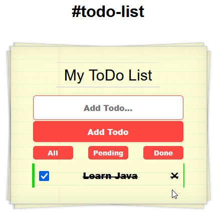

# Todolist

Just a simple Todo List i did to learn some angular and typescript

Live demo at: https://todolist-ebon-nine.vercel.app/

 

## How It's Made:

**Tech used:** HTML, CSS, TypeScript, Angular 13

I wanted to learn some angular and typescript to use it as a frontend for a spring boot backend so i took a little project to see how it works.

## Optimizations

Code may need some refactoring and i want to use interfaces and services to make it more "angular-like" instead of "javascript-like".

Right now it uses LocalStorage, but i may add a connection to an api for storage/login in the future.

## Lessons Learned:

Angular feels very different from react. It reminds me more of spring boot than react.

I wanted to get my hands dirty with the code first to learn the basics, but i should've planned the looks more.

